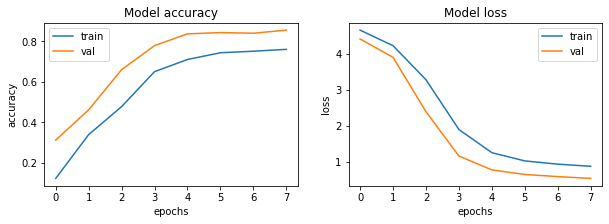
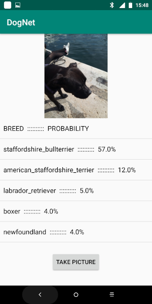

# Dogs breed image recognition CNN 

## 1. Background
A dog shelter needs an automatic system to identify dog breeds and possibly match hybrids to the most probable breeds.

The project goal is to build a ML pipeline that predicts the breeds and associated probabilities from a photo of the dog. 
The algorithm has to be deployed to an API, easy to use for non technical customers.

In a further step an Android app can be built based on the same.

## 2. The data

Having a good training dataset is a huge step towards the robust model. There is [Stanford Dogs Dataset](https://www.kaggle.com/jessicali9530/stanford-dogs-dataset) with ~20K images of dogs of 120 breeds. Every image in the dataset is annotated with the breed of a dog displayed on it. 

## 3. The model
[Full code](https://github.com/opsabarsec/Dog-pictures-classification-by-Deep-Learning/blob/master/notebooks/Stanford_dogs_classifier_part2.ipynb)
Based on Xception convolutional neural network, this model 

provides 85% accuracy. 

The model has been saved to a file that can be loaded in a matter of seconds.
It can be run on [Google Colabs](https://colab.research.google.com/drive/1kcAFOSreOd_68WF5gdvoQOceld7cAwrX) to identify the breed from an uploaded dog picture. 
The same has been deployed to an API, the is result illustrated in this [video](https://www.youtube.com/watch?v=1YKuf0ddEGE). 

The [Android app](https://youtu.be/BlDMGTFu-hM) was built using TensorFlow Lite and importing the model files into Android Studio.

The full explanation of the model and of the results is provided in a [presentation](https://github.com/opsabarsec/Dog-pictures-classification-by-Deep-Learning/blob/master/documentation/presentation/P6_presentation.pdf).

## 4. Conclusions

- Efficient breed recognition can be obtained through a web API, posting a picture and obtaining the most probable 5 breeds in matter of seconds.

- An app for Android devices, OpenDogNet, has been developed and deployed to Google Play . 

